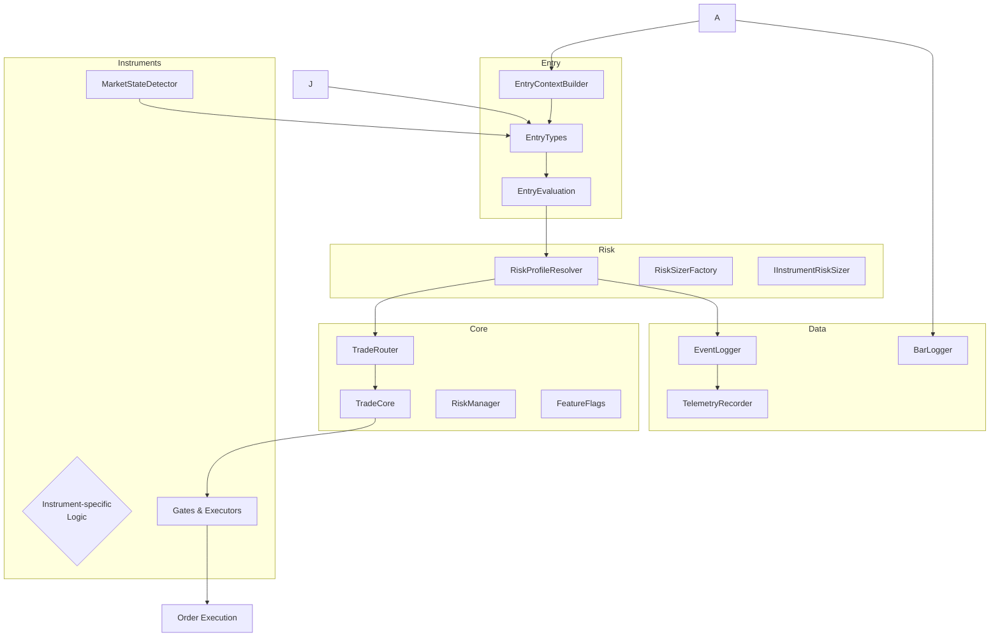

# GeminiV26 Trading Engine

> **Investor Information Pack**
>
> This document provides a comprehensive overview of the GeminiV26 trading system. It is intended for non-technical stakeholders such as investors, analysts, and compliance officers. The architecture is described at a high level, with supporting diagrams and explanations of major components and their responsibilities.
>
> _Conversion to Word:_ this Markdown file can be imported or converted to Microsoft Word using tools such as Pandoc, VS Code's Markdown extensions, or other markdown-to-docx converters.

---

## 1. Product Overview 🧩

GeminiV26 is a high-performance automated trading engine designed to make professional‑grade strategy deployment accessible and scalable.  
It was created with the following objectives in mind:

1. **Consistent trade evaluation** across instruments and sessions using a unified code base.
2. **Robust risk control** that enforces strict stop‑loss, position sizing and lot caps at every step.
3. **Rapid experimentation** with new entry/exit ideas or unusual markets without rewriting core logic.
4. **Full transparency** through logging, dry‑run simulation, and modular components that can be audited.

At its heart the system ingests live market data, applies a library of configurable entry-strategies, computes risk‑aware parameters and either logs the proposal (dry‑run) or dispatches real orders.  
GeminiV26 is engineered for use on cTrader but the architecture is largely platform‑agnostic, giving flexibility for future ports.


## 2. Executive Summary 🧾

GeminiV26 is a modular, event-driven trading platform built in C# and deployed on the cTrader environment. Its core purpose is to evaluate market data across multiple instruments, calculate risk-aware trade proposals, and execute orders while maintaining detailed logs. Risk management, instrument-specific logic, and extensive observability are first-class citizens.

Key value propositions:

1. **Structured strategy library** with dozens of configurable entry types suited for FX, metals, indices, and crypto.
2. **Robust risk engine** that integrates ATR-based sizing, stoploss/takeprofit schemes, and per-instrument caps.
3. **Extensible architecture** allowing rapid addition of new symbols and strategies via simple interfaces.
4. **Dry-run mode** mirrors live execution for safe testing and tuning without financial exposure.
5. **Comprehensive logging** for regulatory compliance, performance analysis, and telemetry.

---

## 2. High-Level Architecture

```mermaid
flowchart LR
    A[Market Data] --> B(EntryContextBuilder)
    B --> C{EntryType
    (Flag, Pullback,
    Breakout, etc.)}
    C --> D[EntryEvaluation]
    D --> E[RiskProfileResolver]
    E --> F{Execution
    /Dry‑Run}
    F --> G[Order Execution
    (Instrument Executors)]
    F --> H[Event Logger
    /Telemetry]
    A --> I[MarketState
    Detectors]
    J[Session Gates] --> C
    D --> K[Trade Router]
```

*Figure 1: Data flow from market feed to order execution and logging.*



*Figure 2: Module organization and interactions.*

---

## 3. Core Components 🔧

### 3.1 Core

- **DryRunExecutor** – risk calculator and logger for simulated trades.
- **TradeCore / TradeRouter / TradeViabilityMonitor** – manage active positions, route signals, enforce global rules.
- **FeatureFlags, BeMode, ExitReason** – runtime configuration enumerations.
- **RiskManager** – implements `IRiskManager` and coordinates risk checks across instruments.

### 3.2 Interfaces

A set of minimal interfaces enabling plug-and-play components:

- `IEntryLogic` – defines how entry conditions are evaluated.
- `IExitManager` – handles exit/scale-out decisions.
- `IGate` – session or condition gates preventing trades at undesired times.
- `IInstrumentProfile` – metadata and configuration for a symbol.
- `IRiskManager` and `IInstrumentRiskSizer` – global and per-instrument risk calculators.

### 3.3 Entry / Strategy Library

Over 40 concrete implementations, grouped under `EntryTypes/`. Common strategy patterns include:

- **Flag entries** – detect directional flags and enter with momentum.
- **Pullback entries** – trade retracements within established moves.
- **Breakout/range entries** – capture volatility expansions.

Subfolders differentiate FX, crypto, metals, and index‑specific tweaks. New strategies are added by implementing `IEntryLogic` and registering the class in the `EntryRouter`.

### 3.4 Exit Rules

Instrument-tailored exit managers decide when to close positions, based on time, profit thresholds, ATR multiples, or custom conditions. Each symbol may have its own `*ExitManager.cs` under `Instruments/…`.

### 3.5 Gating and Market State

- **GlobalSessionGate** – master on/off switch keyed to server time.
- **Instrument session gates** (e.g. `XauSessionGate`, `NasSessionGate`) enforce trading during permitted hours.
- **MarketStateDetector** instances classify trend/range regimes; entry logic consults these to avoid adverse environments.

### 3.6 Risk Management

The risk subsystem calculates trade parameters as a `RiskProfile`:

- Stop loss in ATR multiples and absolute distance.
- Two take‑profit tiers with configurable close ratios.
- Lot sizing as percent of equity, capped by symbol limits.
- Optional break‑even and trailing stop settings controlled by `BeMode`.

Instrument-specific `IInstrumentRiskSizer` implementations (e.g. `XauInstrumentRiskSizer`, `GbpUsdInstrumentRiskSizer`) allow for unique caps/coefficients. The factory selects the appropriate sizer at runtime.

### 3.7 Logging & Persistence

- **BarLogger** – persists OHLC bars to CSV for offline analysis.
- **EventLogger** – records trade events, decisions, errors.
- **SnapshotLogger / TelemetryRecorder** – capture state snapshots for debugging and metrics.

Logs support both live and dry‑run modes; each record includes timestamps, symbol, reason codes, and data.

---

## 4. Instrument Coverage 🎯

The system currently supports the following instrument families (each with numerous symbols):

- **FX:** EURUSD, USDJPY, GBPUSD, AUDUSD, etc.
- **Metals:** XAUUSD, XAGUSD, etc.
- **Indices:** NAS100, US30, GER40, etc.
- **Crypto:** BTCUSD, ETHUSD, etc.

Each instrument folder contains entry logic, exit managers, session gates, market state detectors, and executors tailored to the symbol.

---

## 5. Observability & Testing 📊

All decision points are logged. The architecture encourages unit testing:

- Interfaces make mocking straightforward.
- `RiskSizerFactoryShadow` exists for test seeding.
- Entry and exit logic are stateless and return evaluation objects easily asserted in tests.

Dry‑run executions output summary lines to the cTrader console, facilitating calibration without actual orders.

---

## 6. Extensibility & Roadmap 🛠️

- **Adding a new instrument:** create files in `Instruments/<symbol>` implementing executor, risk sizer, market state detector, entry/exit logic as needed; update the factory/router.
- **Adding a new strategy:** implement `IEntryLogic`, add to `EntryRouter` and optionally provide instrument-specific overrides.
- **Risk tweaks:** modify or extend `RiskProfileResolver` or add new cap rules in `IInstrumentRiskSizer` implementations.

The modular layout ensures minimal cross‑module impact and quick deployment of enhancements.

---

## 7. Compliance & Safety ✅

- Runtime session gating prevents trading during holidays or low-liquidity periods.
- Risk profiles enforce strict lot caps and stop‑losses before orders are allowed.
- Dry‑run mode and extensive logging support review and audit trails.

---

## 8. Appendix (Class Inventory)

A full list of all 202 C# files is maintained separately. It can be generated via `Dir /S /B *.cs` and attached as an addendum for technical due diligence.

---

*Document prepared by GeminiV26 engineering – March 2, 2026.*
